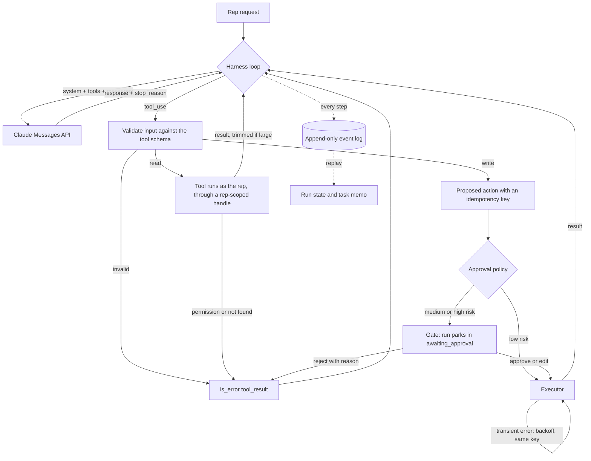
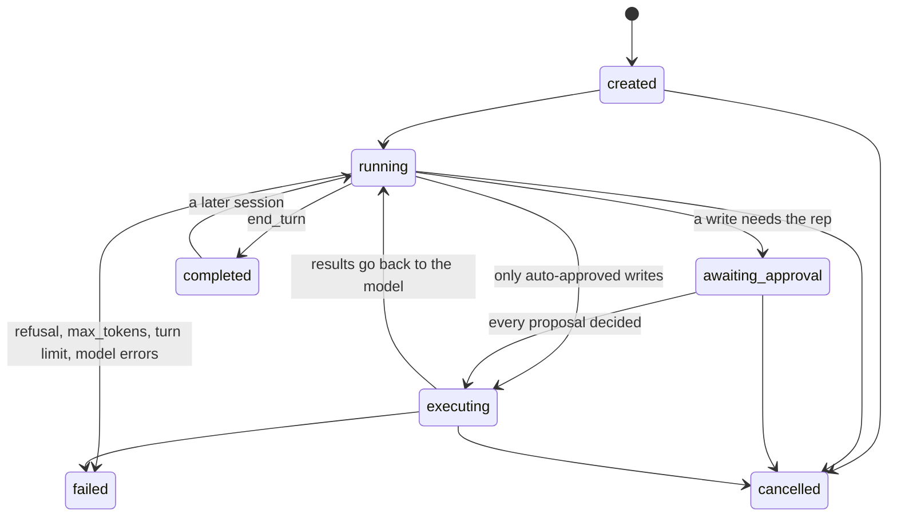

# CRM agent harness: reference implementation

A small, framework-free TypeScript harness for agents that work inside a CRM: they read and write contact, account and deal data, and a sales rep supervises them in real time. It implements one core flow end to end, **"Follow up on my stalled deals"**, with the parts that make agents safe to put in front of a sales team: a tool registry, permission scoping in the tool layer, an approval gate, an explicit run state machine over an append-only event log, idempotent writes, crash recovery, and context management across sessions.

**Live demo:** https://hrenchri-max.github.io/crm-agent-harness-demo/

The page runs the same harness core in your browser, paced so each step is visible (Skip ahead jumps to the next decision; `?fast=1` turns pacing off). The model's steps there were written ahead of time in the exact format the Claude API returns (a public page cannot hold an API key). Everything else, the state machine, permission checks, approval gate, retries, audit log and crash recovery, runs live. `npm run live` runs the same harness against the real Claude API with your own key.

## What the demo shows

Jordan Lee, a sales rep, asks: *"Which of my deals have gone quiet for 14+ days? Draft follow-ups for them and log next steps."* The seeded CRM has two reps. One contact (a procurement consultant) sits on deals owned by both, and a note on Jordan's deal points at a deal Jordan does not own. In one run you can see:

- Read tools run immediately, as Jordan. The agent follows the note to the other rep's deal and gets a **permission error from the tool layer**, returned as an `is_error` tool_result, logged, never retried.
- One proposed task has a malformed date. It **fails schema validation** before anything runs and goes back to the model as an error, which fixes it next turn.
- Two emails and a stage change **park the run** in `awaiting_approval`. Jordan can approve, **edit** (the edited version executes and the model is told), or **reject with a reason** (the reason is the tool_result, and the model turns it into a reminder task). Low-risk tasks are auto-approved by policy, and that is logged too.
- The fake email provider **accepts the first send and then answers 503**. The executor retries with the same idempotency key and the provider returns the original message: **sent exactly once**.
- **Simulate crash + resume** throws away the in-memory harness at any point, reloads the serialized event log, rebuilds state by replay (with a before/after state digest), and continues. Try it at the gate and during the retry backoff.
- **Session 2** starts a fresh conversation from the task memo plus a short excerpt of recent turns, instead of the transcript.

## Run it

```bash
npm install
npm test            # 11 tests: replay/resume, idempotency across a crash, permission denial,
                    # schema failure, edit and reject paths, stop reasons, mocked SDK client
npm run build       # builds the static page into docs/
npm run serve       # http://localhost:4173/crm-agent-harness-demo/
ANTHROPIC_API_KEY=... npm run live                # real Claude API, approvals in the terminal
ANTHROPIC_API_KEY=... npm run live -- "any request"
npm run qa          # Playwright checks and screenshots at 10 viewports (needs a local Chrome)
```

`npm run live` stops at a spend cap (`SPEND_CAP_USD`, default $1), prints token usage and cost per call, and saves the event log to `runs/`. The key is read from the environment and never written anywhere.

## Code map

| File | What it is |
|---|---|
| `src/core/harness.ts` | The manual agentic loop, tool dispatch, approval gate, executor, recovery |
| `src/core/state.ts` | Run state machine, the event reducer (`apply`, `replay`), the task memo |
| `src/core/tools.ts` | Tool registry: schemas, kind, risk, handlers, memo extractors |
| `src/core/context.ts` | System prompt, result trimming, context builder, session hand-off |
| `src/core/crm.ts` | Fake CRM with a rep-scoped handle, fake email provider with idempotency |
| `src/core/validate.ts` | Small JSON Schema validator for tool inputs |
| `src/core/prewritten-model.ts` | The page's model stand-in (same `ModelPort` as the real one) |
| `src/node/anthropic-model.ts` | The real model: `@anthropic-ai/sdk`, `claude-opus-5` |
| `web/main.ts` | The static page |
| `sql/schema.sql` | Postgres tables, append-only trigger, RLS, the approval RPC |

## Architecture



The harness owns the loop (a manual agentic loop, not the SDK tool runner) because the loop is where the guarantees live: every step is an event, the gate can park a run for days, and a different process can pick the run up. The model sits behind a one-method `ModelPort`, so the real API, the page's pre-written turns and the tests' scripted models are interchangeable.

**The model call** (`src/node/anthropic-model.ts`): `claude-opus-5` from one constant, adaptive thinking, `effort: medium`, `max_tokens: 16000`, automatic prompt caching (the system prompt and tool order are fixed so the cached prefix stays valid). Every `stop_reason` is handled: `tool_use` dispatches tools; `end_turn` completes; `pause_turn` re-sends the paused turn (capped); `refusal` and `max_tokens` fail the run loudly and never execute tools from that turn. All tool_results for one assistant turn go back in ONE user message, in tool_use order, failures with `is_error: true`. Assistant content, thinking blocks included, is passed back unchanged.

### The run state machine



State is never stored directly. It is a fold over the event log (`replay(events)`), and an illegal transition throws, including during replay, so a corrupt log fails loudly instead of producing a plausible state. Events: `run_created`, `state_changed`, `model_request`, `model_response`, `tool_called`, `validation_failed`, `permission_denied`, `action_proposed`, `approval_decided`, `action_attempt`, `action_retry_scheduled`, `action_executed`, `action_failed`, `tool_result`, `session_started`, `recovered`. Each carries `seq`, `at` and `actor`, so the log is also the audit trail: every model turn, tool call and input, result, denial, retry and decision, with who and when.

For a graph of multi-step CRM work (sequences, cadences, handoffs between agents), keep this run machine as the unit of durability and compose runs: a parent run whose tool is "start a child run" and whose result is the child's outcome. That keeps one audit and resume model everywhere instead of a second workflow engine.

### Tool contract

```ts
interface ToolDef {
  name: string;
  description: string;        // prescriptive: when to call it, not only what it does
  kind: 'read' | 'write';
  risk: 'low' | 'medium' | 'high';
  input_schema: JsonSchema;   // additionalProperties: false, patterns, enums, lengths
  editable?: string[];        // fields a rep may change at the gate
  authorize?(input, ctx): void;   // write pre-check at proposal time (ownership, contact on the deal)
  handler(input, ctx): unknown;   // ctx = { crm: RepScopedCrm, email, idempotencyKey }
  facts?(input, result): string[]; // lines for the task memo
}
```

Every input is validated against its schema before anything runs, including edited inputs at the gate. Reads execute immediately. Writes never execute directly: they become proposed actions and go through the policy. The page's schemas use `pattern` and length limits, which is why they are sent without `strict: true`; strict tool use works too if a schema stays inside the structured-outputs subset, and the local validation stays either way.

### Permissions and scoping

Tools never receive the database. They receive a `RepScopedCrm`, a handle bound to the acting rep in which every query filters by owner. Touching another rep's deal throws a permission error that goes back to the model as an `is_error` result, is logged as `permission_denied`, and is not retried. The error does not name the other owner.

In a Supabase stack the same boundary should be the database itself. Recommendation: the tools execute through a Supabase client created with the **rep's own JWT**, so row-level security applies to every query the agent makes, exactly as it would for the rep in the UI. The **service-role key never enters the agent's tool layer**. For runs that park for hours or days, mint a short-lived token for the rep at execution time (from a small token service that is the only holder of the signing key) rather than storing the rep's session. The queue worker gets its own narrow Postgres role for the run tables (`agent_worker` in `sql/schema.sql`), not the service role.

### Idempotency and retries

Each proposed write gets `idempotencyKey = hash(runId, tool_use_id)` when it is proposed, and the key survives edits and retries. Errors are classified: `transient` retries with backoff (0.8 s, 1.6 s, three attempts) with the same key; `permission` and `validation` return to the model at once; anything else fails the action and tells the model. The dangerous case is the ambiguous failure, where the provider accepted the message and the response was lost. The demo reproduces it, and the same key makes the retry a no-op at the provider. On the database side the same key is a `UNIQUE` column (`agent_actions.idempotency_key`), and a CRM write is applied at most once per key. After a crash, actions already marked executed are skipped, and an interrupted one resumes its attempt count and reuses its key.

### Context management

- **Within a session** the model gets the session's history. Tool results over 1,600 characters are trimmed before they reach it (newest items first, long strings shortened, an explicit "N older items omitted" marker), while the event log keeps the full result.
- **The task memo** (goal, facts gathered, decisions, pending items) is a deterministic projection of the event log: facts come from each read tool's `facts()` extractor, decisions from approval events, pending items from action states. It is persisted with the run (`agent_runs.memo`) and can always be rebuilt from the log.
- **A later session** starts a fresh conversation: the memo, a plain-text excerpt of the last two turns, and the rep's new message. In the demo that is roughly 900 to 1,100 tokens against about 2,500 to 2,700 for the full history (estimated at four characters per token); the history here is short, and the gap grows with every tool call in a real run. No raw blocks carry over, so thinking blocks are never replayed outside the conversation that produced them.
- **When to reach for compaction:** when a single session itself grows toward the context window, for example a rep working with the agent for hours or a run with hundreds of tool calls. Then turn on server-side compaction (and context editing to clear stale tool results) inside that session. The memo covers the gaps between sessions; compaction covers growth within one.

### Human-in-the-loop policy

| Action | Default |
|---|---|
| Reads | Run immediately, as the rep |
| Low-risk writes (tasks, notes) | Auto-approved by policy; logged as a decision by "Policy" |
| Medium and high risk (stage changes, emails to customers) | Park the run until the rep decides |

All proposals from one model turn are reviewed together, and their results go back together. **Approve** executes as proposed. **Edit** allows only the tool's `editable` fields, re-validates, executes the edited version, and tells the model it was edited and is final. **Reject** requires a reason, which becomes the tool_result. **Cancel** is available at any time; parked proposals are never executed. Recommended next steps for a product: policy as data (per team, role or deal size), expiry for parked runs, and a "rep override" that lets the rep take the draft and finish it by hand, recorded as a decision.

### Failure modes

| Failure | What happens |
|---|---|
| Tool input fails its schema | `validation_failed` event, `is_error` result, nothing runs |
| Rep lacks access to a record | `permission_denied` event, `is_error` result, never retried |
| Transient tool error (503, timeout) | Backoff retries with the same idempotency key, then an `is_error` result |
| Provider accepted, then errored | Same-key retry; the provider or the `UNIQUE` key makes it a no-op |
| Process crash at any point | New harness replays the log; the in-flight step runs again; finished actions are skipped |
| Model API 429, 5xx, connection | Backoff retries, then the run fails loudly |
| `refusal` or `max_tokens` | Run fails; tools from that turn never run |
| `pause_turn` | The paused turn is re-sent to continue, capped |
| Model loops | Turn limit, then `failed` |
| Invalid edit, or rejection without a reason | Refused at the gate; nothing recorded |

## How this maps onto a NestJS + BullMQ + Supabase stack

Recommendations for taking this design into that stack:

- **Harness core as a plain TypeScript package**, wrapped by a NestJS provider (`AgentHarnessService`) that injects the model port, the tool registry and the repositories. Keeping Nest out of the core keeps it testable exactly as it is here.
- **Each loop step as a BullMQ job carrying only the run id.** The worker loads the run's events, replays them, performs one step (one model call, or the pending executions), appends the new events in one transaction, and enqueues the next step unless the run is parked or finished. A deterministic `jobId` (`runId:seq`) drops duplicate jobs; a per-run lock (the `(run_id, seq)` primary key as optimistic concurrency, or an advisory lock) keeps one step in flight per run. BullMQ's own attempts cover worker crashes; the harness's retries cover tool errors.
- **The approval gate parks the run.** No job waits on a rep. The rep's decision reaches a NestJS endpoint with the rep's JWT, which validates any edit against the tool schema and calls `decide_agent_action()` (the RPC in `sql/schema.sql`, which checks ownership and pending state and appends the event). When nothing is left pending, the endpoint enqueues the next step. Supabase Realtime on `agent_events`, filtered by RLS, pushes progress to the rep's screen.
- **Event log and actions as Postgres tables**: `agent_runs`, `agent_events` (append-only, enforced by a trigger), and `agent_actions` with a `UNIQUE` idempotency key, plus RLS so each rep reads only their own runs. See `sql/schema.sql`.

## Limits of this demo

The CRM and email provider are in-memory fakes, the event store is an array with the same append-only contract as the SQL tables, the page's model turns are pre-written, and the schema has been checked with the Postgres parser but not run against a live Supabase project. `npm run live` exercises the real model path.

## License

MIT
